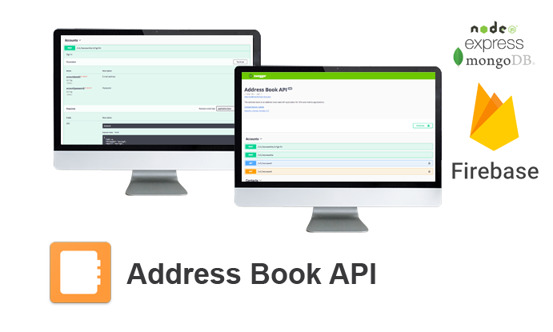

# Address Book API v1.0.0



The address book is an address book web API application for SPA and mobile applications.

## Requirements

* Npm / Yarn
* Node.JS
* Express.JS
* MongoDB

## Installation

* Install yarn package manager `npm install yarn`
* Install all necessary npm packages `yarn`

## Setup

* Setup config file `cp ./config/env.json.sample ./config/env.json && vim ./config/env.json`
* Download and save Google Service Account Key into `./config/serviceAccountKey.json`
* Setup and seed database tables `yarn run seed`

## Run application - development

* `yarn run dev`

## Run application - testing

* `yarn run test`

## Libraries

 * [Node.JS](https://nodejs.org/en/) - Node.js JavaScript runtime
 * [Express.JS](http://expressjs.com/) - Fast, unopinionated, minimalist web framework
 * [Express.JS JWT](https://github.com/auth0/express-jwt) - JWT authentication middleware
 * [MongoDB](https://www.mongodb.com/) - MongoDB is a free and open-source cross-platform document-oriented database program
 * [Mongoose](http://mongoosejs.com/) - Mongoose MongoDB ODM
 * [Passport](http://passportjs.org/) - Simple, unobtrusive authentication for Node.js
 * [Swagger](https://swagger.io/) - Tools for designing and building Swagger-compliant APIs entirely in Node.js
 * [Swagger UI](https://swagger.io/swagger-ui/) - Middleware for your express app to serve the Swagger UI bound to your Swagger document
 * [Chai](http://chaijs.com/) - Chai is a BDD / TDD assertion library for node
 * [Mocha](https://mochajs.org/) - Simple, flexible, fun test framework

# License - Apache License, Version 2.0

```
# (C) Copyright 2017 by Marek Hakala <hakala.marek@gmail.com>
# Licensed under the Apache License, Version 2.0 (the "License");
# you may not use this file except in compliance with the License.
# You may obtain a copy of the License at
#
# http://www.apache.org/licenses/LICENSE-2.0
#
# Unless required by applicable law or agreed to in writing, software
# distributed under the License is distributed on an "AS IS" BASIS,
# WITHOUT WARRANTIES OR CONDITIONS OF ANY KIND, either express or implied.
# See the License for the specific language governing permissions and
#    limitations under the License.
```
